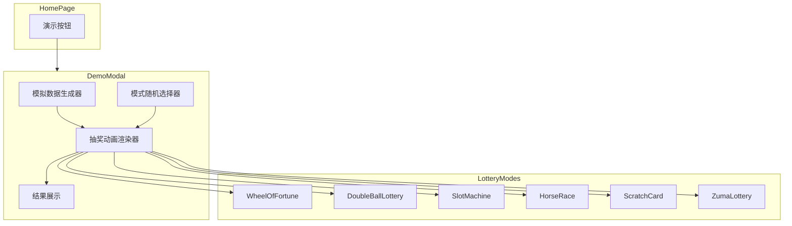

# Design Document: Demo Mode

## Overview

演示模式是一个独立的前端功能，允许用户在首页快速体验抽奖动画效果。该功能完全在客户端运行，不依赖后端 API 或数据库，通过随机生成模拟数据来展示各种抽奖模式的视觉效果。

核心设计原则：
- **零依赖**: 不需要真实数据或后端服务
- **即时体验**: 一键启动，无需配置
- **完整展示**: 使用与真实抽奖相同的动画组件

## Architecture



## Components and Interfaces

### 1. DemoLotteryModal Component

主要的演示模态框组件，负责协调整个演示流程。

```typescript
interface DemoLotteryModalProps {
  isOpen: boolean;
  onClose: () => void;
}

interface DemoState {
  status: 'idle' | 'running' | 'completed';
  participants: MockParticipant[];
  selectedMode: LotteryMode;
  winners: MockParticipant[];
  previousModes: LotteryMode[];  // 用于避免重复选择
}
```

### 2. Mock Data Generator

生成模拟参与者数据的工具函数。

```typescript
interface MockParticipant {
  id: number;
  activityId: number;
  name: string;
  employeeId: string;
  department: string;
  email: string;
  createdAt: Date;
}

function generateMockParticipants(count: number): MockParticipant[];
function selectRandomMode(excludeModes?: LotteryMode[]): LotteryMode;
function selectRandomWinners(participants: MockParticipant[], count: number): MockParticipant[];
```

### 3. Mode Display Mapping

抽奖模式与显示名称的映射。

```typescript
const LOTTERY_MODE_NAMES: Record<LotteryMode, string> = {
  [LotteryMode.DOUBLE_BALL]: '双色球',
  [LotteryMode.SCRATCH]: '刮刮乐',
  [LotteryMode.ZUMA]: '祖玛',
  [LotteryMode.HORSE_RACE]: '赛马',
  [LotteryMode.WHEEL]: '转盘',
  [LotteryMode.SLOT_MACHINE]: '老虎机',
};
```

## Data Models

### MockParticipant

演示模式使用与真实 `Participant` 相同的数据结构，确保与现有抽奖组件的兼容性：

```typescript
interface MockParticipant {
  id: number;           // 自增 ID (1, 2, 3...)
  activityId: number;   // 固定为 0 (演示模式)
  name: string;         // 随机中文姓名
  employeeId: string;   // 随机工号 (如 "EMP001")
  department: string;   // 随机部门名称
  email: string;        // 基于姓名生成的邮箱
  createdAt: Date;      // 当前时间
}
```

### 中文姓名生成规则

```typescript
const SURNAMES = ['张', '王', '李', '赵', '刘', '陈', '杨', '黄', '周', '吴', ...];
const GIVEN_NAMES = ['伟', '芳', '娜', '敏', '静', '丽', '强', '磊', '军', '洋', ...];

// 生成 2-3 字姓名
function generateChineseName(): string;
```

### 部门名称池

```typescript
const DEPARTMENTS = [
  '技术部', '产品部', '设计部', '市场部', '销售部',
  '人力资源部', '财务部', '运营部', '客服部', '行政部'
];
```


## Error Handling

| Scenario | Handling Strategy |
|----------|-------------------|
| Empty participant list | 不应发生，生成器始终生成 10-30 人 |
| All modes excluded | 重置排除列表，允许重复选择 |
| Modal close during animation | 立即停止动画，清理状态 |
| Component unmount | 清理所有定时器和动画状态 |
