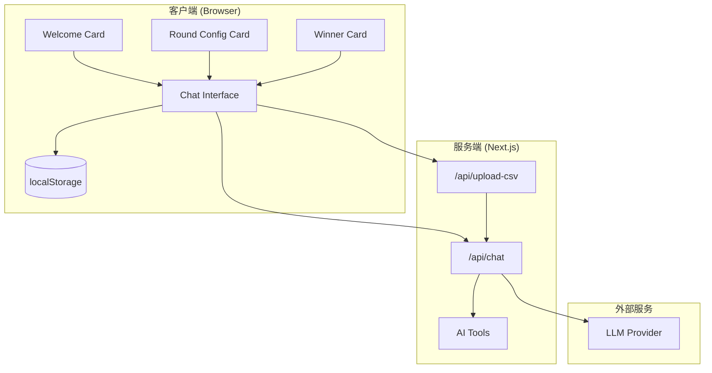
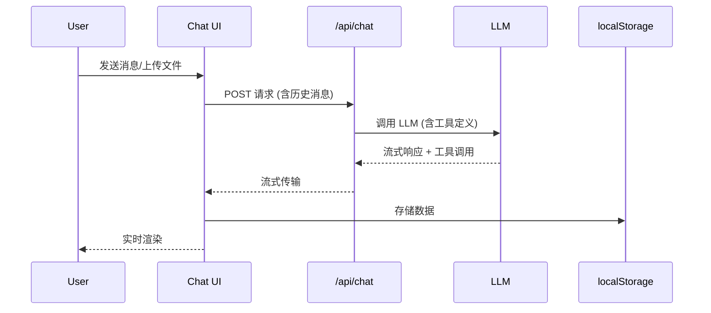
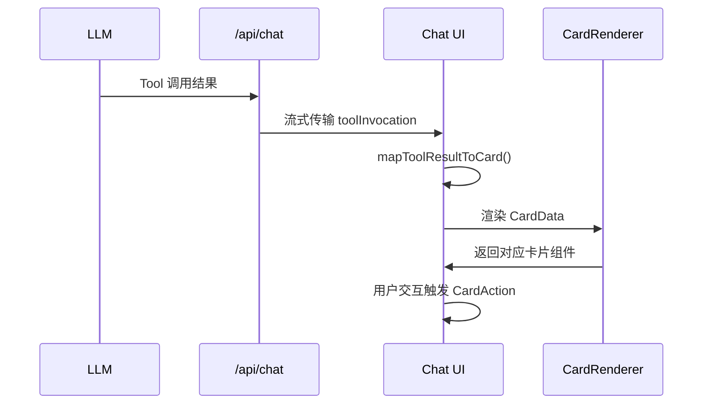

# Design Document

## Overview

本设计文档描述抽奖智能体系统的技术架构和实现方案。系统基于 Next.js 16 App Router 构建，采用 Vercel AI SDK 实现流式聊天交互，使用 React 19 构建自定义组件，数据持久化使用浏览器 localStorage。

### 技术栈选择

- **框架**: Next.js 16 (App Router)
- **UI**: React 19 + Tailwind CSS 4
- **AI SDK**: Vercel AI SDK (`ai` package) - 提供流式响应和工具调用能力
- **CSV 解析**: `papaparse` - 服务端 CSV 解析
- **状态管理**: React Context + localStorage
- **属性测试**: `fast-check` - 用于属性基础测试

## Architecture



### 数据流



## Components and Interfaces

### 页面组件

```typescript
// src/app/page.tsx - 主页面
interface LotteryPageProps {}

// 主聊天页面，包含 ChatProvider 和 ChatInterface
```

### 聊天组件

```typescript
// src/components/chat/ChatInterface.tsx
interface ChatInterfaceProps {
  initialMessages?: Message[];
}

// src/components/chat/MessageList.tsx
interface MessageListProps {
  messages: Message[];
  isLoading: boolean;
}

// src/components/chat/MessageInput.tsx
interface MessageInputProps {
  onSend: (content: string, files?: File[]) => void;
  disabled: boolean;
}
```

### 自定义卡片组件

```typescript
// src/components/cards/WelcomeCard.tsx
interface WelcomeCardProps {
  onAction: (action: 'howToUse' | 'startLottery') => void;
}

// src/components/cards/ParticipantCard.tsx
interface ParticipantCardProps {
  participants: Participant[];
  onConfirm: () => void;
  onCancel: () => void;
}

// src/components/cards/RoundConfigCard.tsx
interface RoundConfigCardProps {
  round: LotteryRound;
  onConfirm: () => void;
  onEdit: () => void;
}

// src/components/cards/WinnerCard.tsx
interface WinnerCardProps {
  round: LotteryRound;
  winners: Winner[];
  onExport: () => void;
}
```

### Context Provider

```typescript
// src/contexts/LotteryContext.tsx
interface LotteryContextValue {
  participants: Participant[];
  rounds: LotteryRound[];
  winners: Winner[];
  currentRoundIndex: number;
  setParticipants: (participants: Participant[]) => void;
  addRound: (round: LotteryRound) => void;
  addWinners: (roundId: string, winners: Winner[]) => void;
  getEligibleParticipants: () => Participant[];
  exportWinners: (roundId: string) => void;
}
```

### API Routes

```typescript
// src/app/api/chat/route.ts
// POST: 处理聊天消息，返回流式响应
// 使用 Vercel AI SDK 的 streamText 和 tools

// src/app/api/upload-csv/route.ts
// POST: 解析上传的 CSV 文件
interface UploadResponse {
  success: boolean;
  participants?: Participant[];
  error?: string;
}
```

### AI Tools 定义

```typescript
// src/lib/ai/tools.ts
const tools = {
  // 解析参与人员数据
  parseParticipants: {
    description: '解析并优化参与人员数据描述',
    parameters: z.object({
      participants: z.array(z.object({
        id: z.string(),
        name: z.string(),
        department: z.string().optional(),
      })),
      summary: z.string(),
    }),
  },

  // 配置抽奖轮次
  configureRound: {
    description: '配置抽奖轮次信息',
    parameters: z.object({
      roundNumber: z.number(),
      prizeName: z.string(),
      prizeQuantity: z.number(),
    }),
  },

  // 执行抽奖
  executeLottery: {
    description: '执行抽奖并返回中奖人员',
    parameters: z.object({
      roundId: z.string(),
      winners: z.array(z.object({
        participantId: z.string(),
        participantName: z.string(),
      })),
    }),
  },
};
```

## Data Models

### 核心数据类型

```typescript
// src/types/index.ts

// 参与者
interface Participant {
  id: string;
  name: string;
  department?: string;
  metadata?: Record<string, string>;
}

// 抽奖轮次
interface LotteryRound {
  id: string;
  roundNumber: number;
  prizeName: string;
  prizeQuantity: number;
  status: 'pending' | 'completed';
  createdAt: number;
}

// 中奖者
interface Winner {
  id: string;
  participantId: string;
  participantName: string;
  roundId: string;
  prizeName: string;
  wonAt: number;
}

// 聊天消息
interface Message {
  id: string;
  role: 'user' | 'assistant';
  content: string;
  toolInvocations?: ToolInvocation[];
  createdAt: Date;
}

// 工具调用
interface ToolInvocation {
  toolName: string;
  args: Record<string, unknown>;
  result?: unknown;
}

// 本地存储数据结构
interface LotteryState {
  participants: Participant[];
  rounds: LotteryRound[];
  winners: Winner[];
  currentRoundIndex: number;
}
```

### 存储键定义

```typescript
// src/lib/storage.ts
const STORAGE_KEYS = {
  LOTTERY_STATE: 'lottery-agent-state',
  CHAT_MESSAGES: 'lottery-agent-messages',
} as const;
```

## Custom Card Rendering System

### 卡片数据格式

LLM 通过 AI Tools 返回结构化数据，系统根据工具调用结果自动触发对应卡片渲染。

```typescript
// src/types/cards.ts

// 卡片类型枚举
type CardType =
  | 'welcome'           // 欢迎卡片
  | 'participant-list'  // 参与人员列表卡片
  | 'round-config'      // 轮次配置卡片
  | 'winner-result'     // 中奖结果卡片
  | 'error';            // 错误提示卡片

// 统一卡片数据结构
interface CardData<T extends CardType = CardType> {
  type: T;
  id: string;           // 唯一标识，用于 React key
  timestamp: number;    // 创建时间戳
  data: CardPayloadMap[T];
}

// 各卡片类型的数据载荷映射
interface CardPayloadMap {
  'welcome': WelcomePayload;
  'participant-list': ParticipantListPayload;
  'round-config': RoundConfigPayload;
  'winner-result': WinnerResultPayload;
  'error': ErrorPayload;
}

// 欢迎卡片数据
interface WelcomePayload {
  title: string;
  message: string;
  actions: Array<{
    id: string;
    label: string;
    action: 'howToUse' | 'uploadCsv' | 'configRound';
  }>;
}

// 参与人员列表卡片数据
interface ParticipantListPayload {
  participants: Participant[];
  summary: string;        // LLM 优化后的描述
  totalCount: number;
  needsConfirmation: boolean;
}

// 轮次配置卡片数据
interface RoundConfigPayload {
  round: LotteryRound;
  description: string;    // LLM 优化后的描述
  needsConfirmation: boolean;
}

// 中奖结果卡片数据
interface WinnerResultPayload {
  round: LotteryRound;
  winners: Winner[];
  remainingParticipants: number;
  canExport: boolean;
}

// 错误卡片数据
interface ErrorPayload {
  title: string;
  message: string;
  retryable: boolean;
}
```

### 卡片渲染器

```typescript
// src/components/cards/CardRenderer.tsx

interface CardRendererProps {
  card: CardData;
  onAction: (action: CardAction) => void;
}

// 卡片动作类型
type CardAction =
  | { type: 'confirm-participants' }
  | { type: 'cancel-participants' }
  | { type: 'confirm-round' }
  | { type: 'edit-round' }
  | { type: 'export-winners'; roundId: string }
  | { type: 'how-to-use' }
  | { type: 'retry' };

// 统一卡片渲染器组件
function CardRenderer({ card, onAction }: CardRendererProps) {
  switch (card.type) {
    case 'welcome':
      return <WelcomeCard data={card.data} onAction={onAction} />;
    case 'participant-list':
      return <ParticipantCard data={card.data} onAction={onAction} />;
    case 'round-config':
      return <RoundConfigCard data={card.data} onAction={onAction} />;
    case 'winner-result':
      return <WinnerCard data={card.data} onAction={onAction} />;
    case 'error':
      return <ErrorCard data={card.data} onAction={onAction} />;
    default:
      return null;
  }
}
```

### Tool 调用与卡片映射

```typescript
// src/lib/ai/card-mapper.ts

// 将 AI Tool 调用结果映射为卡片数据
function mapToolResultToCard(
  toolName: string,
  result: unknown
): CardData | null {
  switch (toolName) {
    case 'parseParticipants':
      return {
        type: 'participant-list',
        id: generateId(),
        timestamp: Date.now(),
        data: {
          participants: result.participants,
          summary: result.summary,
          totalCount: result.participants.length,
          needsConfirmation: true,
        },
      };

    case 'configureRound':
      return {
        type: 'round-config',
        id: generateId(),
        timestamp: Date.now(),
        data: {
          round: {
            id: generateId(),
            roundNumber: result.roundNumber,
            prizeName: result.prizeName,
            prizeQuantity: result.prizeQuantity,
            status: 'pending',
            createdAt: Date.now(),
          },
          description: result.description,
          needsConfirmation: true,
        },
      };

    case 'executeLottery':
      return {
        type: 'winner-result',
        id: generateId(),
        timestamp: Date.now(),
        data: {
          round: result.round,
          winners: result.winners,
          remainingParticipants: result.remainingCount,
          canExport: true,
        },
      };

    default:
      return null;
  }
}
```

### 消息中的卡片渲染流程



## Correctness Properties

*A property is a characteristic or behavior that should hold true across all valid executions of a system-essentially, a formal statement about what the system should do. Properties serve as the bridge between human-readable specifications and machine-verifiable correctness guarantees.*

### Property 1: Lottery State Persistence Round-Trip

*For any* valid LotteryState (containing participants, rounds, and winners), serializing to localStorage and then deserializing should produce an equivalent LotteryState object.

**Validates: Requirements 2.4, 3.4, 4.4, 7.1, 7.2, 7.3, 7.4**

### Property 2: CSV Parsing Produces Valid Participants

*For any* valid CSV content with name columns, parsing should produce an array of Participant objects where each participant has a non-empty id and name.

**Validates: Requirements 2.1**

### Property 3: Invalid CSV Returns Error

*For any* malformed CSV content (missing required columns, empty content), parsing should return an error result rather than invalid participant data.

**Validates: Requirements 2.5**

### Property 4: Lottery Round Structure Validity

*For any* LotteryRound object, it should contain a positive roundNumber, non-empty prizeName, and positive prizeQuantity.

**Validates: Requirements 3.2**

### Property 5: Eligible Participants Excludes Winners

*For any* set of participants and winners, the eligible participants should equal the set of participants whose IDs are not in the winners' participantId set.

**Validates: Requirements 4.3**

### Property 6: Sequential Round Enforcement

*For any* sequence of lottery rounds, executing round N should only be allowed when all rounds 1 to N-1 have status 'completed'.

**Validates: Requirements 4.6**

### Property 7: Export Filename Format

*For any* LotteryRound, the generated export filename should match the pattern "{roundNumber}-{prizeName}-{prizeQuantity}".

**Validates: Requirements 5.3**

### Property 8: Winner Count Matches Prize Quantity

*For any* completed lottery round, the number of winners for that round should equal the round's prizeQuantity (or the number of eligible participants if fewer than prizeQuantity).

**Validates: Requirements 5.2**

## Error Handling

### 客户端错误处理

| 错误场景 | 处理方式 |
|---------|---------|
| CSV 文件格式错误 | 显示错误消息，提示正确格式 |
| 文件大小超限 | 显示错误消息，提示文件大小限制 |
| localStorage 不可用 | 降级到内存存储，提示用户数据不会持久化 |
| 网络请求失败 | 显示重试按钮，允许用户重新发送 |
| 流式响应中断 | 显示部分内容，提供重试选项 |

### 服务端错误处理

| 错误场景 | 处理方式 |
|---------|---------|
| CSV 解析失败 | 返回 400 错误，包含具体错误信息 |
| LLM API 调用失败 | 返回 503 错误，提示稍后重试 |
| 请求参数无效 | 返回 400 错误，包含验证错误详情 |

### 业务逻辑错误处理

| 错误场景 | 处理方式 |
|---------|---------|
| 尝试跳过抽奖轮次 | 返回提示消息，说明必须按顺序执行 |
| 参与人员不足 | 返回提示消息，说明剩余人数不足以完成抽奖 |
| 重复执行已完成轮次 | 返回提示消息，说明该轮次已完成 |

## Testing Strategy

### 单元测试

使用 Vitest 进行单元测试，覆盖以下模块：

- **数据模型验证**: 测试 Participant、LotteryRound、Winner 的创建和验证
- **存储操作**: 测试 localStorage 读写操作
- **工具函数**: 测试文件名生成、数据转换等工具函数
- **CSV 解析**: 测试各种 CSV 格式的解析结果

### 属性基础测试

使用 `fast-check` 库进行属性基础测试。每个属性测试配置运行至少 100 次迭代。

测试文件命名规范：`*.property.test.ts`

每个属性测试必须包含注释，格式为：
```typescript
// **Feature: lottery-agent, Property {number}: {property_text}**
```

### 测试覆盖范围

| 测试类型 | 覆盖内容 |
|---------|---------|
| 属性测试 | 数据持久化、CSV 解析、参与者筛选、轮次顺序、文件名格式 |
| 单元测试 | 组件渲染、工具函数、数据验证 |
| 集成测试 | API 路由、流式响应 |
