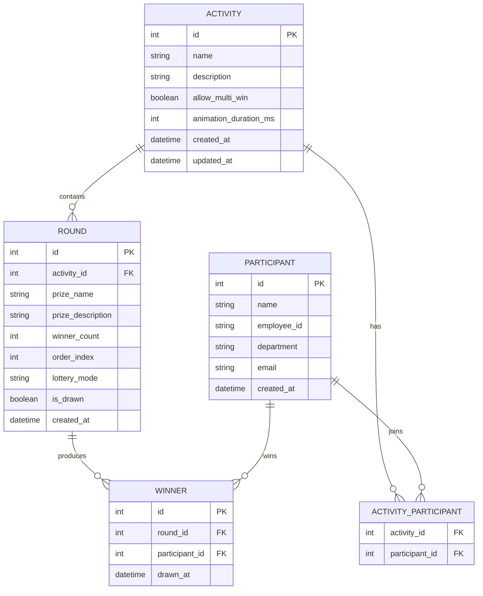

# Design Document

## Overview

抽奖系统是一个基于 Next.js 的全栈 Web 应用程序，提供多种创意抽奖模式和完整的活动管理功能。系统采用前后端一体化架构设计，使用 SQLite 作为本地数据库，支持参与人员管理、活动配置、轮次设置和中奖结果导出。前端提供丰富的动画效果展示各种抽奖模式。

### 技术栈

- **框架**: Next.js 15 (App Router)
- **语言**: TypeScript
- **数据库**: SQLite (better-sqlite3)
- **UI 组件**: Tailwind CSS + shadcn/ui
- **动画**: Framer Motion
- **CSV 处理**: csv-parse / csv-stringify
- **测试框架**: Vitest + fast-check (属性测试)

## Architecture

系统采用 Next.js 全栈架构，前后端一体化设计：

```mermaid
graph TB
    subgraph Frontend["前端 (React Components)"]
        Pages[页面组件]
        ParticipantPage[参与人员管理页]
        ActivityPage[活动管理页]
        LotteryPage[抽奖执行页]
        AnimationComponents[动画组件]
    end

    subgraph API["API 层 (Route Handlers)"]
        ParticipantAPI[/api/participants]
        ActivityAPI[/api/activities]
        RoundAPI[/api/rounds]
        LotteryAPI[/api/lottery]
        ExportAPI[/api/export]
    end

    subgraph Business["业务层 (Services)"]
        ParticipantService[参与人员服务]
        ActivityService[活动服务]
        RoundService[轮次服务]
        LotteryService[抽奖服务]
        ExportService[导出服务]
    end

    subgraph Data["数据层 (Repository)"]
        ParticipantRepo[参与人员仓库]
        ActivityRepo[活动仓库]
        RoundRepo[轮次仓库]
        WinnerRepo[中奖记录仓库]
    end

    subgraph LotteryModes["抽奖动画组件"]
        DoubleBall[双色球动画]
        Scratch[刮刮乐动画]
        Zuma[祖玛动画]
        HorseRace[赛马动画]
        Wheel[转盘动画]
        SlotMachine[老虎机动画]
    end

    Pages --> ParticipantPage
    Pages --> ActivityPage
    Pages --> LotteryPage
    LotteryPage --> AnimationComponents
    AnimationComponents --> LotteryModes

    ParticipantPage --> ParticipantAPI
    ActivityPage --> ActivityAPI
    ActivityPage --> RoundAPI
    LotteryPage --> LotteryAPI
    LotteryPage --> ExportAPI

    ParticipantAPI --> ParticipantService
    ActivityAPI --> ActivityService
    RoundAPI --> RoundService
    LotteryAPI --> LotteryService
    ExportAPI --> ExportService

    ParticipantService --> ParticipantRepo
    ActivityService --> ActivityRepo
    RoundService --> RoundRepo
    LotteryService --> WinnerRepo

    ParticipantRepo --> DB[(SQLite)]
    ActivityRepo --> DB
    RoundRepo --> DB
    WinnerRepo --> DB
```

### 项目结构

```
lottery-system/
├── app/                          # Next.js App Router
│   ├── layout.tsx               # 根布局
│   ├── page.tsx                 # 首页/仪表盘
│   ├── participants/            # 参与人员管理
│   │   └── page.tsx
│   ├── activities/              # 活动管理
│   │   ├── page.tsx            # 活动列表
│   │   └── [id]/               # 活动详情
│   │       ├── page.tsx
│   │       └── lottery/        # 抽奖执行
│   │           └── page.tsx
│   └── api/                     # API 路由
│       ├── participants/
│       ├── activities/
│       ├── rounds/
│       ├── lottery/
│       └── export/
├── components/                   # React 组件
│   ├── ui/                      # shadcn/ui 组件
│   ├── lottery-modes/           # 抽奖动画组件
│   │   ├── DoubleBallLottery.tsx
│   │   ├── ScratchCard.tsx
│   │   ├── ZumaLottery.tsx
│   │   ├── HorseRace.tsx
│   │   ├── WheelOfFortune.tsx
│   │   └── SlotMachine.tsx
│   └── shared/                  # 共享组件
├── lib/                         # 核心库
│   ├── db/                      # 数据库
│   │   ├── index.ts            # 数据库连接
│   │   └── schema.ts           # 表结构
│   ├── repositories/            # 数据仓库
│   ├── services/               # 业务服务
│   └── types/                  # 类型定义
└── __tests__/                   # 测试文件
    └── properties/             # 属性测试
```

## Components and Interfaces

### 1. 数据访问层 (Repository)

```typescript
// 基础仓库接口
interface IRepository<T, ID> {
  findById(id: ID): T | null;
  findAll(): T[];
  create(entity: Omit<T, 'id'>): T;
  update(id: ID, entity: Partial<T>): T | null;
  delete(id: ID): boolean;
}

// 参与人员仓库
interface IParticipantRepository extends IRepository<Participant, number> {
  findByActivityId(activityId: number): Participant[];
  importFromCSV(data: ParticipantCSVRow[]): ImportResult;
  findAvailableForRound(activityId: number, roundId: number, allowMultiWin: boolean): Participant[];
}

// 活动仓库
interface IActivityRepository extends IRepository<Activity, number> {
  findWithRounds(id: number): ActivityWithRounds | null;
}

// 轮次仓库
interface IRoundRepository extends IRepository<Round, number> {
  findByActivityId(activityId: number): Round[];
  updateOrder(activityId: number, roundIds: number[]): void;
}

// 中奖记录仓库
interface IWinnerRepository {
  create(winner: Omit<Winner, 'id'>): Winner;
  findByRoundId(roundId: number): Winner[];
  findByActivityId(activityId: number): Winner[];
  findByParticipantId(participantId: number): Winner[];
  deleteByRoundId(roundId: number): number;
}
```

### 2. 业务服务层 (Services)

```typescript
// 参与人员服务
interface IParticipantService {
  importParticipants(filePath: string): Promise<ImportResult>;
  addParticipant(data: CreateParticipantDTO): Participant;
  updateParticipant(id: number, data: UpdateParticipantDTO): Participant | null;
  deleteParticipant(id: number): boolean;
  listParticipants(): Participant[];
  getParticipant(id: number): Participant | null;
}

// 活动服务
interface IActivityService {
  createActivity(data: CreateActivityDTO): Activity;
  updateActivity(id: number, data: UpdateActivityDTO): Activity | null;
  deleteActivity(id: number): boolean;
  listActivities(): Activity[];
  getActivity(id: number): ActivityWithRounds | null;
}

// 轮次服务
interface IRoundService {
  addRound(activityId: number, data: CreateRoundDTO): Round;
  updateRound(id: number, data: UpdateRoundDTO): Round | null;
  deleteRound(id: number): boolean;
  getRounds(activityId: number): Round[];
}

// 抽奖服务
interface ILotteryService {
  executeDraw(roundId: number, mode: LotteryMode): DrawResult;
  getDrawResult(roundId: number): Winner[];
  getAvailableParticipants(activityId: number, roundId: number): Participant[];
}

// 导出服务
interface IExportService {
  exportWinners(activityId: number, filePath: string): Promise<void>;
  exportRoundWinners(roundId: number, filePath: string): Promise<void>;
}
```

### 3. 抽奖模式接口

```typescript
// 抽奖模式枚举
enum LotteryMode {
  DOUBLE_BALL = 'double_ball',    // 双色球
  SCRATCH = 'scratch',             // 刮刮乐
  ZUMA = 'zuma',                   // 祖玛
  HORSE_RACE = 'horse_race',       // 赛马
  WHEEL = 'wheel',                 // 转盘
  SLOT_MACHINE = 'slot_machine'    // 老虎机
}

// 抽奖模式处理器接口
interface ILotteryModeHandler {
  readonly mode: LotteryMode;
  readonly name: string;
  readonly description: string;

  // 执行抽奖动画并返回中奖者
  execute(participants: Participant[], winnerCount: number): Promise<Participant[]>;

  // 显示抽奖动画
  displayAnimation(participants: Participant[], winners: Participant[]): Promise<void>;
}
```

### 4. 前端组件接口

```typescript
// 抽奖动画组件 Props
interface LotteryAnimationProps {
  participants: Participant[];
  winnerCount: number;
  durationMs: number; // 动画时长（毫秒）
  onComplete: (winners: Participant[]) => void;
  isRunning: boolean;
}

// 抽奖模式组件映射
const LotteryModeComponents: Record<LotteryMode, React.ComponentType<LotteryAnimationProps>> = {
  [LotteryMode.DOUBLE_BALL]: DoubleBallLottery,
  [LotteryMode.SCRATCH]: ScratchCard,
  [LotteryMode.ZUMA]: ZumaLottery,
  [LotteryMode.HORSE_RACE]: HorseRace,
  [LotteryMode.WHEEL]: WheelOfFortune,
  [LotteryMode.SLOT_MACHINE]: SlotMachine,
};

// 抽奖执行页面状态管理
interface LotteryPageState {
  activity: ActivityWithRounds | null;
  currentRoundIndex: number; // 当前轮次索引
  availableParticipants: Participant[];
  roundWinners: Map<number, Participant[]>; // 每轮的中奖者
  isDrawing: boolean;
  isAutoMode: boolean; // 是否自动进行下一轮
}

// 抽奖流程控制
interface LotteryFlowController {
  startActivity(): void;      // 开始活动，自动进入第一轮
  nextRound(): void;          // 进入下一轮
  pauseActivity(): void;      // 暂停活动
  resumeActivity(): void;     // 恢复活动
  getCurrentRound(): Round | null;
  isLastRound(): boolean;
  isActivityComplete(): boolean;
}

// API 响应类型
interface ApiResponse<T> {
  success: boolean;
  data?: T;
  error?: string;
}
```

## Data Models

### 数据库 Schema



### 配置常量

```typescript
// 默认动画时长（毫秒）- 可在活动级别覆盖
const DEFAULT_ANIMATION_DURATION_MS = 60000; // 60秒

// 动画时长范围限制
const MIN_ANIMATION_DURATION_MS = 10000;  // 最少10秒
const MAX_ANIMATION_DURATION_MS = 300000; // 最多5分钟
```

### TypeScript 类型定义

```typescript
// 参与人员
interface Participant {
  id: number;
  name: string;
  employeeId: string;
  department: string;
  email: string;
  createdAt: Date;
}

// 抽奖活动
interface Activity {
  id: number;
  name: string;
  description: string;
  allowMultiWin: boolean;
  animationDurationMs: number; // 动画时长（毫秒），默认60000
  createdAt: Date;
  updatedAt: Date;
}

// 活动（含轮次）
interface ActivityWithRounds extends Activity {
  rounds: Round[];
  participants: Participant[];
}

// 抽奖轮次 - 每轮可配置独立的抽奖模式
interface Round {
  id: number;
  activityId: number;
  prizeName: string;
  prizeDescription: string;
  winnerCount: number;
  orderIndex: number;
  lotteryMode: LotteryMode; // 每轮独立的抽奖模式
  isDrawn: boolean;
  createdAt: Date;
}

// 中奖记录
interface Winner {
  id: number;
  roundId: number;
  participantId: number;
  drawnAt: Date;
}

// 中奖记录（含详情）
interface WinnerWithDetails extends Winner {
  participant: Participant;
  round: Round;
  activity: Activity;
}

// CSV 导入行
interface ParticipantCSVRow {
  name: string;
  employeeId: string;
  department: string;
  email: string;
}

// 导入结果
interface ImportResult {
  success: number;
  failed: number;
  errors: Array<{ row: number; message: string }>;
}

// 抽奖结果
interface DrawResult {
  round: Round;
  winners: Participant[];
  mode: LotteryMode;
  drawnAt: Date;
}

// DTO 类型
interface CreateParticipantDTO {
  name: string;
  employeeId: string;
  department: string;
  email: string;
}

interface UpdateParticipantDTO {
  name?: string;
  employeeId?: string;
  department?: string;
  email?: string;
}

interface CreateActivityDTO {
  name: string;
  description: string;
  allowMultiWin: boolean;
  animationDurationMs?: number; // 可选，默认60000ms
  participantIds: number[];
}

interface UpdateActivityDTO {
  name?: string;
  description?: string;
  allowMultiWin?: boolean;
  animationDurationMs?: number;
}

interface CreateRoundDTO {
  prizeName: string;
  prizeDescription: string;
  winnerCount: number;
  lotteryMode: LotteryMode; // 每轮独立配置抽奖模式
}

interface UpdateRoundDTO {
  prizeName?: string;
  prizeDescription?: string;
  winnerCount?: number;
  orderIndex?: number;
  lotteryMode?: LotteryMode;
}
```


## Correctness Properties

*A property is a characteristic or behavior that should hold true across all valid executions of a system-essentially, a formal statement about what the system should do. Properties serve as the bridge between human-readable specifications and machine-verifiable correctness guarantees.*

基于需求分析，以下是系统必须满足的正确性属性：

### Property 1: 参与人员 CRUD 往返一致性
*For any* 有效的参与人员数据，创建参与人员后查询应返回相同的数据（除自动生成的 id 和 createdAt 外）
**Validates: Requirements 1.2, 1.3, 1.5**

### Property 2: 参与人员删除完整性
*For any* 已创建的参与人员，删除后通过 ID 查询应返回 null，且不出现在列表中
**Validates: Requirements 1.4**

### Property 3: CSV 导入有效数据保留
*For any* 包含有效和无效行的 CSV 数据，导入后数据库中的记录数应等于有效行数，且所有有效数据被正确存储
**Validates: Requirements 1.1, 1.6**

### Property 4: 活动 CRUD 往返一致性
*For any* 有效的活动数据，创建活动后查询应返回相同的数据
**Validates: Requirements 3.1, 3.2, 3.3, 3.4**

### Property 5: 活动级联删除完整性
*For any* 包含轮次和中奖记录的活动，删除活动后所有关联的轮次和中奖记录也应被删除
**Validates: Requirements 3.5**

### Property 6: 轮次排序一致性
*For any* 活动的轮次列表，返回的轮次应按 orderIndex 升序排列
**Validates: Requirements 4.4**

### Property 7: 轮次级联删除完整性
*For any* 包含中奖记录的轮次，删除轮次后所有关联的中奖记录也应被删除
**Validates: Requirements 4.3**

### Property 8: 抽奖人数边界检查
*For any* 抽奖轮次，当配置的中奖人数大于可用参与人员数量时，系统应拒绝执行并返回错误
**Validates: Requirements 4.5**

### Property 9: 抽奖结果数量正确性
*For any* 有效的抽奖执行，返回的中奖者数量应等于轮次配置的中奖人数
**Validates: Requirements 5.1**

### Property 10: 抽奖结果来源有效性
*For any* 抽奖结果，所有中奖者必须来自该活动的参与人员池
**Validates: Requirements 5.1**

### Property 11: 禁用多次中奖时的排除规则
*For any* 禁用多次中奖的活动，已在之前轮次中奖的参与人员不应出现在后续轮次的可用参与人员池中
**Validates: Requirements 2.2, 2.3**

### Property 12: 启用多次中奖时的包含规则
*For any* 启用多次中奖的活动，已中奖的参与人员仍应出现在后续轮次的可用参与人员池中
**Validates: Requirements 2.1**

### Property 13: 中奖结果持久化往返
*For any* 抽奖执行，中奖结果存储后查询应返回相同的中奖者信息
**Validates: Requirements 5.2, 5.3**

### Property 14: 导出数据完整性
*For any* 中奖结果导出，生成的 CSV 文件解析后应包含所有中奖记录的完整信息（活动名称、轮次、奖品、中奖人员）
**Validates: Requirements 5.4**

### Property 15: 数据库事务一致性
*For any* 数据写入操作失败时，数据库状态应保持不变（回滚）
**Validates: Requirements 8.2, 8.3**

### Property 16: 数据持久化往返
*For any* 保存到数据库的数据，重新连接数据库后应能完整恢复
**Validates: Requirements 8.4**

## Error Handling

### 错误类型定义

```typescript
// 基础错误类
class LotteryError extends Error {
  constructor(
    message: string,
    public code: string,
    public details?: Record<string, unknown>
  ) {
    super(message);
    this.name = 'LotteryError';
  }
}

// 具体错误类型
class ValidationError extends LotteryError {
  constructor(message: string, details?: Record<string, unknown>) {
    super(message, 'VALIDATION_ERROR', details);
  }
}

class NotFoundError extends LotteryError {
  constructor(entity: string, id: number) {
    super(`${entity} with id ${id} not found`, 'NOT_FOUND', { entity, id });
  }
}

class InsufficientParticipantsError extends LotteryError {
  constructor(required: number, available: number) {
    super(
      `Insufficient participants: required ${required}, available ${available}`,
      'INSUFFICIENT_PARTICIPANTS',
      { required, available }
    );
  }
}

class DatabaseError extends LotteryError {
  constructor(message: string, originalError?: Error) {
    super(message, 'DATABASE_ERROR', { originalError: originalError?.message });
  }
}

class CSVParseError extends LotteryError {
  constructor(row: number, message: string) {
    super(`CSV parse error at row ${row}: ${message}`, 'CSV_PARSE_ERROR', { row });
  }
}
```

### 错误处理策略

| 场景 | 错误类型 | 处理方式 |
|------|----------|----------|
| 参与人员不存在 | NotFoundError | 返回错误信息，不中断流程 |
| CSV 格式错误 | CSVParseError | 跳过错误行，记录错误，继续处理 |
| 中奖人数超限 | InsufficientParticipantsError | 拒绝执行，提示用户调整配置 |
| 数据库写入失败 | DatabaseError | 回滚事务，返回错误信息 |
| 无效输入数据 | ValidationError | 拒绝操作，返回具体验证错误 |

## Testing Strategy

### 测试框架

- **单元测试**: Vitest
- **属性测试**: fast-check (与 Vitest 集成)
- **测试覆盖率**: 目标 80%+

### 双重测试方法

系统采用单元测试和属性测试相结合的方式：

1. **单元测试**: 验证具体示例、边界条件和错误处理
2. **属性测试**: 验证应在所有有效输入上成立的通用属性

### 属性测试要求

- 使用 fast-check 库进行属性测试
- 每个属性测试运行至少 100 次迭代
- 每个属性测试必须标注对应的正确性属性编号
- 标注格式: `**Feature: lottery-system, Property {number}: {property_text}**`

### 测试文件结构

```
src/
├── repositories/
│   ├── participant.repository.ts
│   └── participant.repository.test.ts
├── services/
│   ├── lottery.service.ts
│   └── lottery.service.test.ts
└── __tests__/
    └── properties/
        ├── participant.properties.test.ts
        ├── activity.properties.test.ts
        ├── lottery.properties.test.ts
        └── export.properties.test.ts
```

### 生成器策略

为属性测试定义智能生成器：

```typescript
// 参与人员生成器
const participantArb = fc.record({
  name: fc.string({ minLength: 1, maxLength: 50 }),
  employeeId: fc.stringMatching(/^EMP\d{6}$/),
  department: fc.constantFrom('Engineering', 'Sales', 'HR', 'Finance', 'Marketing'),
  email: fc.emailAddress()
});

// 活动生成器
const activityArb = fc.record({
  name: fc.string({ minLength: 1, maxLength: 100 }),
  description: fc.string({ maxLength: 500 }),
  lotteryMode: fc.constantFrom(...Object.values(LotteryMode)),
  allowMultiWin: fc.boolean()
});

// 轮次生成器
const roundArb = fc.record({
  prizeName: fc.string({ minLength: 1, maxLength: 100 }),
  prizeDescription: fc.string({ maxLength: 500 }),
  winnerCount: fc.integer({ min: 1, max: 10 })
});

// CSV 行生成器（包含有效和无效数据）
const csvRowArb = fc.oneof(
  participantArb, // 有效行
  fc.record({ name: fc.constant(''), employeeId: fc.string() }) // 无效行
);
```

### 关键测试场景

1. **参与人员管理**
   - CRUD 操作的往返一致性
   - CSV 导入的有效/无效数据处理
   - 批量操作的原子性

2. **活动和轮次管理**
   - 级联删除的完整性
   - 轮次排序的正确性
   - 数据关联的一致性

3. **抽奖逻辑**
   - 中奖人数的正确性
   - 多次中奖规则的执行
   - 边界条件处理

4. **数据导出**
   - CSV 格式的正确性
   - 数据完整性验证
