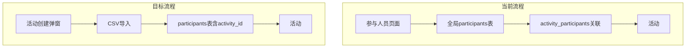

# Design Document: Participant Isolation

## Overview

本设计文档描述如何重构抽奖系统的参与人员管理方式，实现活动级人员隔离，并将动画时长配置从活动级别移动到轮次级别。

主要变更：
1. 修改数据库结构，将参与人员直接关联到活动（添加 `activity_id` 字段）
2. 移除全局参与人员管理页面和相关API
3. 在活动创建弹窗中集成CSV导入功能
4. 在活动详情页支持参与人员管理
5. 将 `animation_duration_ms` 从 `activities` 表移动到 `rounds` 表

## Architecture

### 当前架构

```
participants (全局)
     ↓
activity_participants (关联表)
     ↓
activities
     ↓
rounds (无动画时长)
```

### 目标架构

```
activities
     ↓
participants (activity_id 外键)
     ↓
rounds (含 animation_duration_ms)
```

### 数据流变更



## Components and Interfaces

### 1. 数据库变更

#### participants 表修改
- 添加 `activity_id` 字段（NOT NULL，外键关联 activities.id）
- 添加级联删除约束
- 移除全局唯一性约束（employee_id 改为活动内唯一）

#### rounds 表修改
- 添加 `animation_duration_ms` 字段（默认值 60000）

#### activities 表修改
- 移除 `animation_duration_ms` 字段

#### 删除表
- 删除 `activity_participants` 关联表

### 2. API 变更

#### 移除的 API
- `GET /api/participants` - 全局参与人员列表
- `POST /api/participants` - 创建全局参与人员
- `PUT /api/participants/[id]` - 更新全局参与人员
- `DELETE /api/participants/[id]` - 删除全局参与人员
- `POST /api/participants/import` - 全局CSV导入

#### 修改的 API
- `POST /api/activities` - 支持直接创建参与人员数据
- `GET /api/activities/[id]` - 返回活动级参与人员
- `GET /api/activities/[id]/participants` - 获取活动参与人员
- `POST /api/activities/[id]/participants/import` - 活动级CSV导入
- `DELETE /api/activities/[id]/participants/[participantId]` - 删除活动参与人员
- `POST /api/activities/[id]/rounds` - 支持动画时长参数
- `PUT /api/rounds/[id]` - 支持动画时长参数

### 3. 前端组件变更

#### 移除的组件/页面
- `src/app/participants/page.tsx` - 参与人员管理页面

#### 修改的组件
- `src/components/layout/Sidebar.tsx` - 移除参与人员导航项
- `src/app/activities/page.tsx` - 活动创建弹窗集成CSV导入
- `src/app/activities/[id]/page.tsx` - 添加参与人员管理区域，轮次配置添加动画时长

### 4. 服务层变更

#### ParticipantService
- 移除全局操作方法
- 添加 `importParticipantsForActivity(activityId, csvContent)` 方法
- 添加 `deleteParticipantFromActivity(activityId, participantId)` 方法

#### ActivityService
- 修改 `createActivity` 支持直接创建参与人员
- 移除 `animationDurationMs` 相关逻辑

#### RoundService
- 添加 `animationDurationMs` 字段处理

## Data Models

### 修改后的 Participant 类型

```typescript
export interface Participant {
  id: number;
  activityId: number;  // 新增
  name: string;
  employeeId: string;
  department: string;
  email: string;
  createdAt: Date;
}
```

### 修改后的 Activity 类型

```typescript
export interface Activity {
  id: number;
  name: string;
  description: string;
  allowMultiWin: boolean;
  // 移除 animationDurationMs
  createdAt: Date;
  updatedAt: Date;
}
```

### 修改后的 Round 类型

```typescript
export interface Round {
  id: number;
  activityId: number;
  prizeName: string;
  prizeDescription: string;
  winnerCount: number;
  orderIndex: number;
  lotteryMode: LotteryMode;
  animationDurationMs: number;  // 新增
  isDrawn: boolean;
  createdAt: Date;
}
```

### 修改后的 CreateActivityDTO

```typescript
export interface CreateActivityDTO {
  name: string;
  description: string;
  allowMultiWin: boolean;
  // 移除 animationDurationMs
  // 移除 participantIds
  participants: ParticipantCSVRow[];  // 新增：直接传入人员数据
}
```

### 修改后的 ParticipantCSVRow

```typescript
// CSV 导入行 - 仅姓名必填
export interface ParticipantCSVRow {
  name: string;           // 必填
  employeeId?: string;    // 可选
  department?: string;    // 可选
  email?: string;         // 可选
}
```

### CSV 模板格式

模板文件 `participants_template.csv` 内容：
```csv
姓名,工号,部门,邮箱
张三,EMP001,技术部,zhangsan@example.com
```

字段说明：
- 姓名（name）：必填，参与人员姓名
- 工号（employeeId/employee_id/工号）：可选，员工工号
- 部门（department/部门）：可选，所属部门
- 邮箱（email/邮箱）：可选，电子邮箱

### 修改后的 CreateRoundDTO

```typescript
export interface CreateRoundDTO {
  prizeName: string;
  prizeDescription: string;
  winnerCount: number;
  lotteryMode: LotteryMode;
  animationDurationMs?: number;  // 新增，默认 60000
}
```


## Correctness Properties

*A property is a characteristic or behavior that should hold true across all valid executions of a system-essentially, a formal statement about what the system should do. Properties serve as the bridge between human-readable specifications and machine-verifiable correctness guarantees.*

### Property 1: CSV解析往返一致性
*For any* 有效的参与人员数据列表，将其序列化为CSV格式后再解析，应产生等价的人员数据列表（姓名字段完全匹配）。
**Validates: Requirements 1.3, 1.4**

### Property 2: 活动级人员隔离
*For any* 两个不同的活动A和B，向活动A导入的参与人员在查询活动B的参与人员时不应出现。
**Validates: Requirements 2.1, 2.2**

### Property 3: 活动删除级联清理
*For any* 包含参与人员的活动，删除该活动后，查询该活动的参与人员应返回空列表。
**Validates: Requirements 2.3, 5.4**

### Property 4: 同一人员多活动独立性
*For any* 人员信息，在不同活动中导入后，应创建独立的记录（不同的ID），且各活动的人员数量独立计算。
**Validates: Requirements 2.4**

### Property 5: CSV追加导入累加性
*For any* 活动，多次CSV导入后，参与人员总数应等于所有有效导入记录的累加。
**Validates: Requirements 4.2**

### Property 6: 参与人员删除正确性
*For any* 活动中的参与人员，删除后该人员不应出现在该活动的参与人员列表中，且活动人员数量减少1。
**Validates: Requirements 4.3**

### Property 7: 轮次动画时长默认值
*For any* 创建的轮次，如果未指定动画时长，查询该轮次应返回默认值60000毫秒。
**Validates: Requirements 6.4**

### Property 8: 轮次动画时长更新
*For any* 轮次和有效的动画时长值，更新后查询该轮次应返回更新后的值。
**Validates: Requirements 6.2**

### Property 9: 仅姓名必填验证
*For any* CSV行数据，只要姓名字段非空，该行应被成功解析；姓名为空的行应被跳过。
**Validates: Requirements 1.4, 1.5**

## Error Handling

### CSV 解析错误
- 文件格式无效：返回错误信息 "无效的CSV格式"
- 缺少姓名字段：跳过该行，记录 "第X行：姓名不能为空"
- 文件为空：返回错误信息 "CSV文件为空"

### 活动创建错误
- 无有效参与人员：返回错误信息 "请至少导入一名参与人员"
- 活动名称为空：返回错误信息 "活动名称不能为空"

### 参与人员操作错误
- 参与人员不存在：返回 404 错误
- 参与人员不属于该活动：返回 403 错误

### 轮次配置错误
- 动画时长超出范围（10-300秒）：返回验证错误

## Testing Strategy

### 单元测试
- CSV解析函数测试
- 数据验证函数测试
- 类型转换函数测试

### 属性测试
使用 `fast-check` 库进行属性测试：
- 每个属性测试运行至少100次迭代
- 测试注释格式：`**Feature: participant-isolation, Property {number}: {property_text}**`

### 集成测试
- API端点测试
- 数据库操作测试
- 前端组件交互测试

